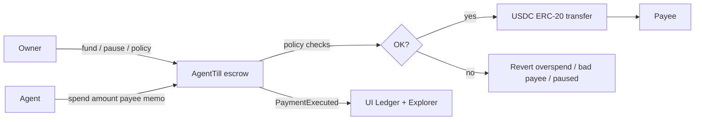

# AgentTill

**Policy-bound agentic USDC till / micropayment desk on [Circle Arc](https://docs.arc.io)** — built for Arc Microgrants.

Deposit a USDC budget into escrow, register spending agents, and enforce max-per-payment, daily/session caps, optional payee allowlists, and required memos **onchain**. Fees display as dollars (typically `~$0.01`), never Gwei/ETH.

## What it is

| Flow | What happens |
|------|----------------|
| **Create Till** | Owner deposits USDC; sets policy |
| **Register Agent** | Bind an address that can spend only within policy |
| **Agent Spend** | `spend(amount, payee, reason)` — policy checks + transfer + events |
| **Ledger** | Payment feed with Arc explorer links + remaining budget |
| **Owner Controls** | Pause, top-up, withdraw, allowlist / limits |

No OpenAI/LLM required for the core demo. Self-contained — no external agent registry.

## Why Arc

- **USDC-native L1** — balances and gas are dollar-denominated.
- **Microgrant economics** — typical fees `~$0.01`, so small stipends stay rational.
- **Canonical USDC** — ERC-20 `0x3600…0000` at **6 decimals** for app balances/transfers. Native gas is the same USDC pool at 18 decimals — the UI shows **one** ERC-20 USDC balance (never double-count).
- Mainnet chain `5042` · Testnet `5042002` · Docs: https://docs.arc.io

## Architecture



```
AgentTill/
├── packages/contracts/   # Foundry: AgentTill, Factory, MockUSDC, tests, deploy
├── apps/web/             # Next.js App Router + wagmi/viem dashboard
├── README.md
├── DEPLOY.md
└── .env.example
```

## Local run

### Contracts

```bash
# after clone: git submodule update --init --recursive
cd packages/contracts
forge test
```

### Web

```bash
cd apps/web
cp ../../.env.example .env.local   # optional; leave till address unset for demo mode
npm install
npm run dev
```

Open http://localhost:3000 — landing + `/dashboard` with demo till when no contract address is set.

WalletConnect: set `NEXT_PUBLIC_WC_PROJECT_ID` for WC QR; injected wallets (MetaMask, etc.) work without it.

```bash
npm run build   # production build
```

If build fails solely because WC id is missing, injected-only config still builds — WC is optional.

## Deploy to Arc

See **[DEPLOY.md](./DEPLOY.md)**. Mainnet gas requires USDC on the deployer.

```bash
cd packages/contracts
forge script script/Deploy.s.sol:Deploy --rpc-url https://rpc.testnet.arc.io --broadcast
```


## Cloudflare Workers / Pages

`NEXT_PUBLIC_*` vars are **inlined at build time**. Set them in the Cloudflare dashboard (or `wrangler`) **and rebuild** — runtime-only env changes will not update the client bundle.

| Variable | Example | Notes |
|----------|---------|--------|
| `NEXT_PUBLIC_AGENT_TILL_ADDRESS` | `0xA40E8DA38760eAf987eF85CD00b28319F11c4CAD` | Deployed AgentTill; omit for demo mode |
| `NEXT_PUBLIC_DEFAULT_NETWORK` | `testnet` | `testnet` \| `mainnet` (Arc 5042002 / 5042) |
| `NEXT_PUBLIC_USDC_ADDRESS` | `0x3600…0000` | Optional; defaults to Arc canonical USDC |
| `NEXT_PUBLIC_WC_PROJECT_ID` | *(public WC id)* | Optional; injected wallets work without it |

After changing these, trigger a fresh Workers/Pages build so the dashboard binds the onchain till (header shows the address; spend/owner use wagmi `spend` / `fund` / etc.).

You can also paste a till address in the dashboard **Till address** bar (localStorage override) without rebuilding.

## DoraHacks / submission blurb

**AgentTill** is a policy-bound USDC micropayment desk on Circle Arc for microgrants: owners escrow budget, agents spend within onchain caps/allowlists, and the ledger shows dollar fees — built for Arc’s USDC-native L1.

**What Arc is used for**

- Settlement of all till deposits, agent spends, and withdrawals in Arc USDC
- Dollar-native gas so microgrant payments are economically viable
- Mainnet (5042) / testnet (5042002) deployment targets with Arc explorers for ledger links
- Canonical USDC ERC-20 at `0x3600…0000` (6 decimals) for balances and transfers

## Stack

- **Contracts:** Foundry, OpenZeppelin (Ownable, Pausable, ReentrancyGuard, SafeERC20)
- **Web:** Next.js 15 App Router, TypeScript, Tailwind, wagmi + viem
- **No hardcoded secrets** — see `.env.example`

## License

MIT
